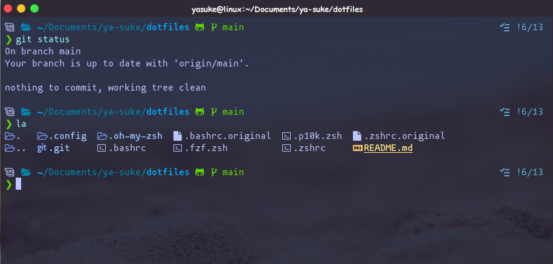

## /\\/!n]a's Dotfiles

### To install this configuration: 
Default 

`$ sh -c "$(curl -fsLS git.io/chezmoi)" -- init --apply <github-username>`

#### Transitory environment (short-lived Linux containers)

`$ sh -c "$(curl -fsLS git.io/chezmoi)" -- init --one-shot <github-username>`
